<h2>Genomewide Co-selection and Epistasis in Bacteria</h2>
<picture>
<source media="(prefers-color-scheme: dark)" srcset="images/icon_dark.jpg" height="155">
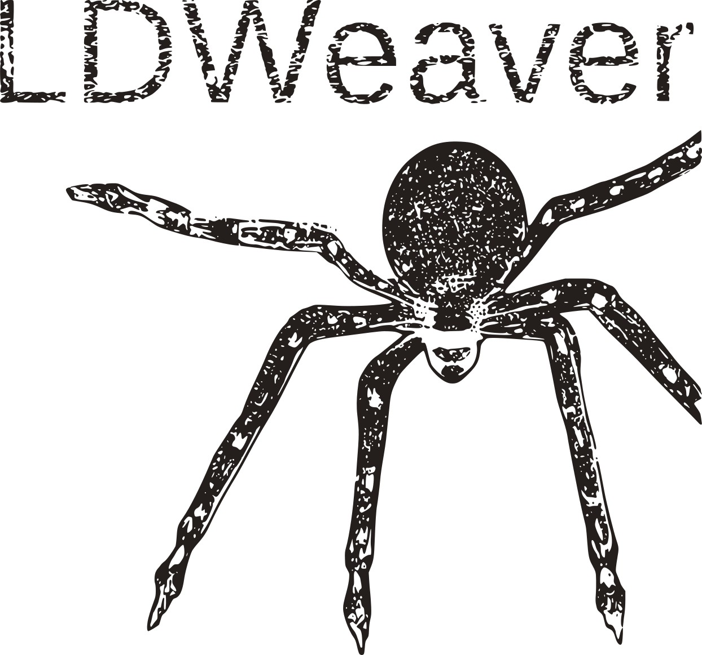
</picture>


<!-- badges: start -->

[](https://github.com/Sudaraka88/LDWeaver/actions)
[](https://zenodo.org/badge/latestdoi/590009521)
[](https://spdx.org/licenses/GPL-3.0-or-later.html)
<!-- badges: end -->

## About

LDWeaver accepts a sequence alignment (fasta) and its reference annotation 
(genbank or gff) as inputs and identifies linkage disequilibrium (LD) between 
pairs of variants (links) that is unusually high given the genomic distance 
between the pair. This high LD could be the result of co-selection or epistasis. 
Approximate statistical significance is used to rank outlier links and the 
output is reported in `tsv` format, along with several other helpful annotations and figures. 
Additionally, LDWeaver has functions to assist the detection of genomic regions 
that have potentially undergone co-selection or epistasis. LDWeaver `tsv` output 
can be directly used as input for 
<a href="https://github.com/jurikuronen/GWES-Explorer">GWESExplorer</a>
for dynamic link visualisation.

## Installation
### Using `devtools`
`LDWeaver` is available on github. It can be installed with
`devtools`

``` r
install.packages("devtools")
devtools::install_github("Sudaraka88/LDWeaver")
```
### Using `bioconda`
[](https://anaconda.org/bioconda/r-ldweaver)
[](https://anaconda.org/bioconda/r-ldweaver)
[](https://anaconda.org/bioconda/r-ldweaver)
[](https://anaconda.org/bioconda/r-ldweaver)

*Preferred Method - using* `mamba` 

If you haven't already, first, you need to install <a href="https://mamba.readthedocs.io/en/latest/mamba-installation.html#mamba-install" target="_blank">mamba</a>. Afterwards, create a new environment and install `r-ldweaver`:
```conda
conda create -n r-ldweaver
conda activate r-ldweaver
mamba install -c conda-forge -c bioconda r-ldweaver
```

Alternatively, you can use <a href="https://docs.conda.io/projects/conda/en/latest/user-guide/install/index.html#regular-installation" target="_blank">conda</a>.
```conda
conda create -n r-ldweaver
conda activate r-ldweaver
conda install -c conda-forge -c bioconda r-ldweaver
```

## Quick Start

To run LDWeaver, all you need is a fasta alignment (can be gz
compressed) and the corresponding genbank (preferred, or gff3 also supported) 
annotation file with the reference sequence. You can also use a SNP-only alignment (can be generated from <a href="http://sanger-pathogens.github.io/snp-sites/" target="_blank">snp-sites</a> or <a href="https://github.com/Sudaraka88/FastaR" target="_blank">FastaR</a>) with a numeric vector of SNP positions as per the reference genome. 

A toy dataset is provided in the 
package itself to confirm that everything is setup correctly.

> **Note** For GWES analysis, it is recommended to use an alignment with
> a large number of sequences (\>500). Such alignments can be several
> gigabytes in size and not suitable to bundle into an R package. A proper example 
> using real data is available [below](#detailed-workthrough-using-real-data).


The toy alignment comprises the first 50kb of 400 *S. pnuemoniae*
isolates (randomy selected from the 616 reported
<a href="https://www.nature.com/articles/ng.2625" target="_blank">here</a>).
The reads were aligned against the
<a href="https://www.ncbi.nlm.nih.gov/nuccore/NC_011900.1" target="_blank">ATCC
700669 reference genome</a> using
<a href="https://github.com/tseemann/snippy" target="_blank">snippy</a>.
Since this is only a part of an alignment, we set
`validate_ref_ann_lengths = F`, which forces LDWeaver to ignore the
mismatch in sequence lengths between the genbank reference sequence and the 
alignment. Several additional options are also used, see
`help(package="LDWeaver")` for more details.

``` r
# devtools::install_github("Sudaraka88/LDWeaver")
library(LDWeaver)
dset <- "sample"
aln_path <- system.file("extdata", "sample.aln.gz", package = "LDWeaver")
gbk_path <- system.file("extdata", "sample.gbk", package = "LDWeaver")
snp_filt_method = "relaxed"
LDWeaver(dset = dset, aln_path = aln_path, gbk_path = gbk_path, validate_ref_ann_lengths = F,
num_clusts_CDS = 2, SnpEff_Annotate = F, snp_filt_method = snp_filt_method)
```

>**Note** If you are using a SNP-only alignment, set `aln_has_all_bases = F` and provide `pos`, a numeric vector of SNP positions. Each SNP in the SNP-only alignment must have a unique SNP position.

## Citation

Please cite LDWeaver using: Mallawaarachchi, Sudaraka et al. Detecting co-selection through excess linkage disequilibrium in bacterial genomes. bioRxiv 2023.08.04.551407; doi: https://doi.org/10.1101/2023.08.04.551407


## Detailed Workthrough using Real Data

The following analysis demonstrates most of the options available in
LDWeaver. The alignment with 616 *S. pnuemoniae* genomes is available
<a href="https://uio-my.sharepoint.com/:u:/g/personal/sudarakm_uio_no/EeLNWOGYDi5Bk4PVY6JZF10BEDM2ckSCMq4nZqX8OGimJg?e=3AfBhf" target="_blank">here</a>, and 
the same sample.gbk annotation was used to generate this alignment (also available <a href="https://www.ncbi.nlm.nih.gov/nuccore/NC_011900.1?report=gbwithparts&log$=seqview" target="_blank">here</a>).

> **Note:** Alternatively, since LDWeaver v1.2, you can download and use the <a href="https://uio-my.sharepoint.com/:u:/g/personal/sudarakm_uio_no/EdQdnfYv3KRBiuYW73BEGXgBbtZR2SSdty_qiNgjJflp5w?e=vbpeEp" target="_blank">SNP-only alignment</a> with the accompanying <a href="https://uio-my.sharepoint.com/:u:/g/personal/sudarakm_uio_no/EZoekLiIyZZKuVAoHoWob1cBk2yBSOfr4MeuLp_VgKJG5g" target="_blank">positions</a> file to generate the same results.

For this example, it is assumed that the current working directory is set to 
`~/LDWeaver_run` and the
<a href="https://cloudstor.aarnet.edu.au/plus/s/KBRnIt1H6XZ2XFR" target="_blank">alignment</a>
is available in the same folder. Please note that file paths here are written for Linux/macOS operating systems, 
windows users will need to modify as needed. 

The following few lines of code can perform the complete LDWeaver analysis.

``` r
library(LDWeaver)
### WARNING! Possible runtime > 1h

setwd("~/LDWeaver_run")

dset <- "msch"
aln_path <- "spn23f_msch.aln.gz"
gbk_path <- system.file("extdata", "sample.gbk", package = "LDWeaver")

LDWeaver::LDWeaver(dset = dset, 
aln_path = aln_path, 
gbk_path = gbk_path, 
save_additional_outputs = T)
```

`LDWeaver::LDWeaver()` one-liner is versatile for most 
analyses. If previously created outputs are available in \<dset\>, this
function will load those instead of repeating possibly time and resource heavy analysis.

It is also possible to write customised pipelines using available functions. For a full list of available functions
and options, run: `help(package="LDWeaver")`.

``` r
library(LDWeaver)
dset <- "msch"
dir.create(dset) # folder to save outputs

aln_path <- "~/LDWeaver_run/spn23f_msch.aln.gz"
gbk_path <- system.file("extdata", "sample.gbk", package = "LDWeaver")
ncores = parallel::detectCores()

snp.dat = LDWeaver::parse_fasta_alignment(aln_path = aln_path) # parse the alignment and extract SNPs
gbk = LDWeaver::parse_genbank_file(gbk_path = gbk_path, g = snp.dat$g) # parse the annotation
cds_var = LDWeaver::estimate_variation_in_CDS(gbk = gbk, snp.dat = snp.dat, 
ncores = ncores, 
num_clusts_CDS = 3, 
clust_plt_path = "msch/CDS_clustering.png")
```

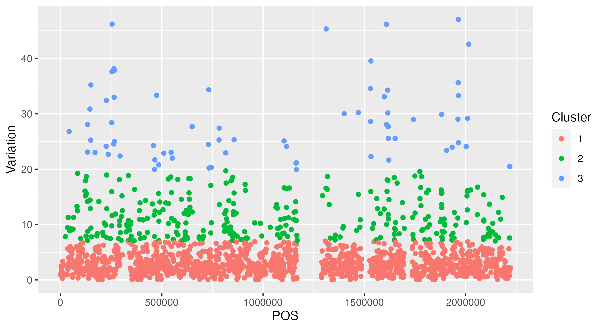

``` r
hdw = LDWeaver::estimate_Hamming_distance_weights(snp.dat = snp.dat) # Hamming distance weights

# Perform MI computation model fitting and ARACNE - this will take some time...
sr_links = LDWeaver::perform_MI_computation(snp.dat = snp.dat, hdw = hdw,
cds_var = cds_var, ncores = ncores,
lr_save_path = "msch/lr_links.tsv", 
sr_save_path = "msch/sr_links.tsv",
plt_folder = dset)
```

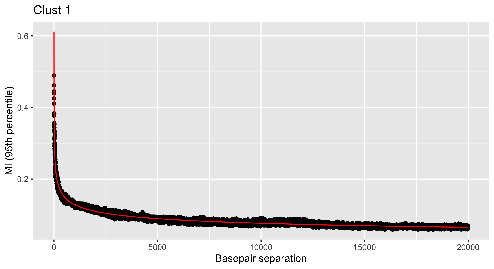 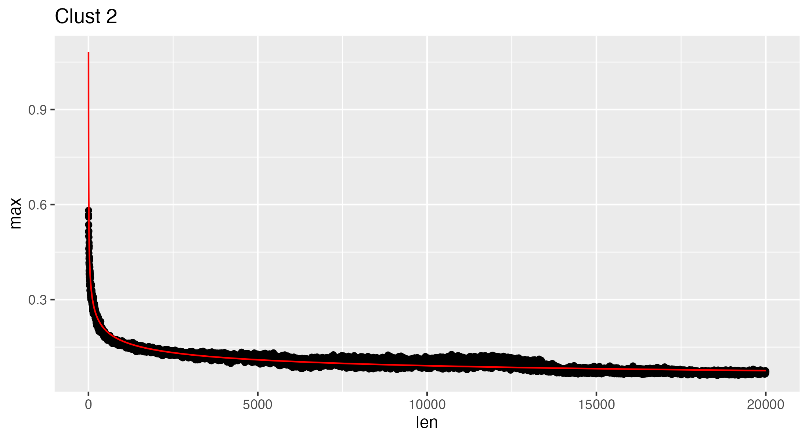
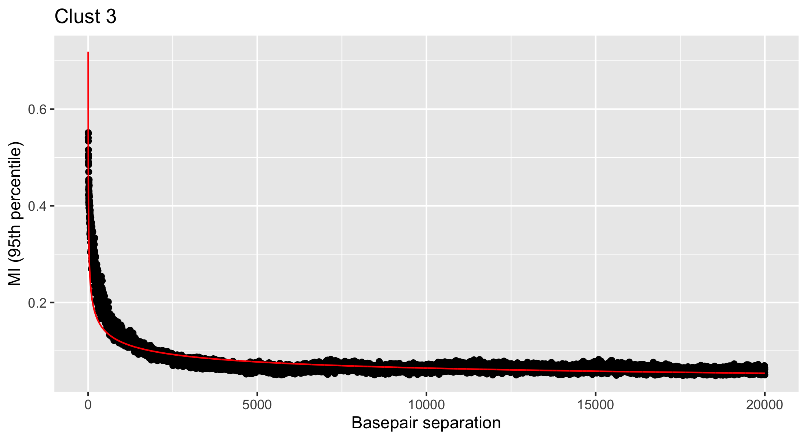

``` r
# Generate GWES Plots (short-range)
LDWeaver::make_gwes_plots(sr_links = sr_links, plt_folder = dset)
```

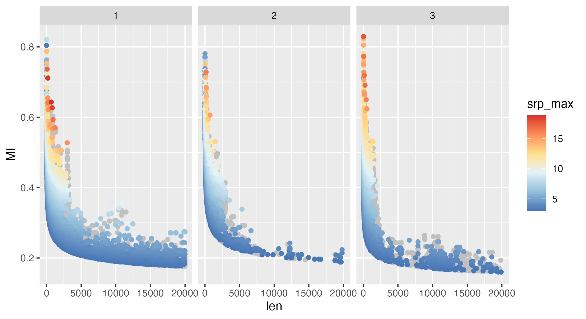 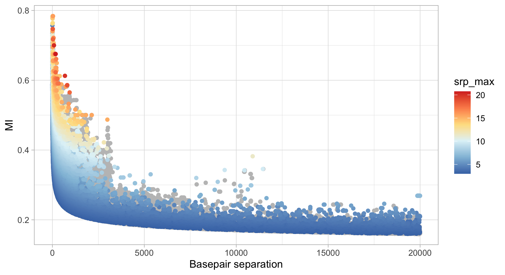

``` r
# Identify the top hits by performing snpEff annotations
tophits = LDWeaver::perform_snpEff_annotations(dset_name = dset, annotation_folder = file.path(getwd(), dset), 
gbk = gbk, gbk_path = gbk_path, cds_var = cds_var, 
links_df = sr_links, snp.dat = snp.dat, 
tophits_path = "msch/sr_tophits.tsv")
```

This will generate several outputs comprising annotations into the
\<msch\> folder, please see [Performing Annotations](#performing-annotations).

``` r
# Generate tanglegram
LDWeaver::create_tanglegram(tophits =  tophits, gbk = gbk, tanglegram_folder = "msch/SR_Tanglegram")
```

Above line will create 5 tanglegrams in html format, the first one
should look like this: 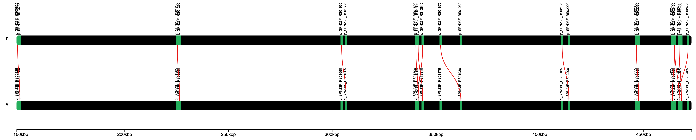

``` r
# Generate GWES Explorer outputs
LDWeaver::write_output_for_gwes_explorer(snp.dat = snp.dat, tophits = tophits, 
gwes_explorer_folder = "msch/SR_GWESExplorer")
```

Above line will create three files in \<msch/SR_GWESExplorer/\> that can be
used as inputs for
<a href="https://github.com/jurikuronen/GWES-Explorer" target="_blank">GWESExplorer</a>.
In addition, it is possible to provide a <a href="https://www.ncbi.nlm.nih.gov/nuccore/NC_011900.1?report=gbwithparts&log$=seqview" target="_blank">GFF3 annotation file</a>,
phenotype data and a core genome phylogeny. The circular GWESExplorer plot should look like this:
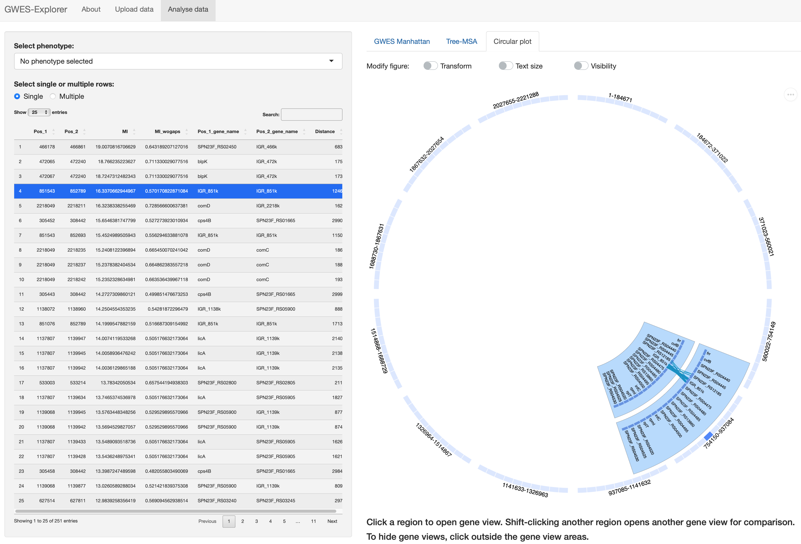


Next step is to analyse the long range links
``` r
# Analyse long range links
LDWeaver::analyse_long_range_links(dset = dset, lr_links_path = "msch/lr_links.tsv", 
sr_links_path = "msch/sr_links.tsv", SnpEff_Annotate = T,
snp.dat = snp.dat, gbk_path = gbk_path, cds_var = cds_var)
```
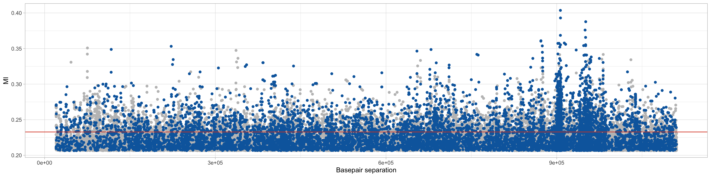

By this time, the `msch` folder is cluttered with a large number of outputs. 
`LDWeaver::LDWeaver` one-liner will automatically tidy up these files in to several folders. 
This can be done using the `cleanup` function.

``` r
LDWeaver::cleanup(dset)
```

It is possible to generate a genomewide LD distribution map using the following:
``` r
LDWeaver::genomewide_LDMap(lr_links_path = "msch/Temp/lr_links.tsv", 
sr_links_path = "msch/Temp/sr_links.tsv", 
plot_save_path = "msch/GWLD.png")
```
> **Note** The paths have now updated after running LDWeaver::cleanup().

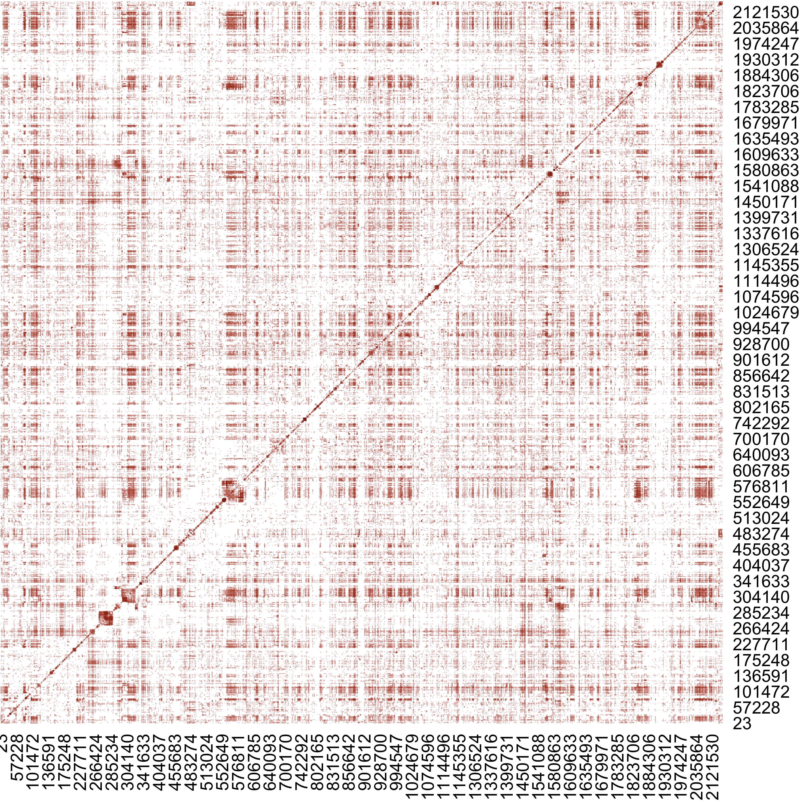

A `network plot` for the pbp genes showcasing both the number of links between 
sites and their magnitude can be generated using:

``` r
# Generate the Network Plot for pbp genes

network = LDWeaver::create_network_for_gene("pbp", 
sr_annotated_path = "msch/Annotated_links/sr_links_annotated.tsv", 
lr_annotated_path = "msch/Annotated_links/lr_links_annotated.tsv", 
level = 2)

LDWeaver::create_network(network, 
plot_title = "pbp network", 
netplot_path = "msch/pbp_network.png", 
plot_w = 2000, plot_h = 2000)
```
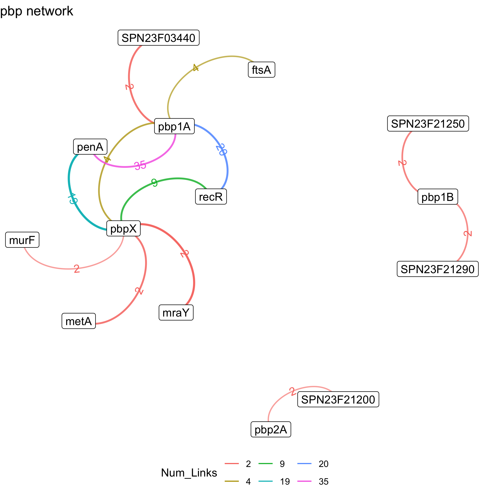

## Additional Information

> **Note** With LDWeaver >1.5, you can analyse mega scale datasets with > 2^(32-1) elements. This requires <a href="https://cran.r-project.org/web/packages/spam/" target="_blank">spam</a> and <a href="https://cran.r-project.org/web/packages/spam64/" target="_blank">spam64</a> packages. Set `mega_dset=T` in `LDWeaver::LDWeaver()` to use this feature. Warning! This is currently considerably slower than the default mode (`mega_dset=F`) and only supports single core operations. There will also be minor discrepancies between the two methods due to floating point errors, however, this should only have a minimal impact on the final link ranking. 

### Key Outputs

If the above steps worked as expected, the following output will be saved to a 
folder called `sample`, which should be created in the current working directory.
(Working directory can be queried using: `getwd()`).

- Figures

1.  sample/cX_fit.png - shows the distribution and modelling of the
background linkage disequilibrium (estimated using weighted Mutual
Information) vs. bp-separation within each cluster (X = 1,2 in the
example)
2.  sample/CDS_clustering.png - shows the genome partitioning, based on 
the CDS diversity (compared to the reference sequence)
3.  sample/sr_gwes_clust.png - short-range GWES plot for each cluster (2 in
this case)
4.  sample/sr_gwes_combi.png - combined short-range GWES plot (for links with
bp positions spanning two clusters, the max srp_value is used)
5.  sample/lr_gwes.png - Long range GWES plot (similar to the output from
<a href="https://github.com/santeripuranen/SpydrPick" target="_blank">SpydrPick</a>)

- Outputs

1.  sample/sr_links.tsv - tab separated file containing details on
short-range links (i.e. links \<= sr_dist bp apart)
2.  sample/lr_links.tsv - tab separated file containing details on long-range
links (i.e. links \> sr_dist bp apart)

### Extra Outputs

> **Note** The default `sr_dist` value in LDWeaver is 20000bp (user modifiable).
> This means that by default, links from SNPs <20kb apart are considered short-range.

- Additional Outputs (*not generated*) - can be used to avoid costly re-computations.

1.  Additional_Outputs/snp_ACGTN.rds - list comprising sparse SNP data from the alignment
2.  Additional_Outputs/parsed_gbk.rds - GenBankRecord of the genbank annotation data
3.  Additional_Outputs/hdw.rds - named vector comprising Hamming distance weights for
each sequence
4.  Additional_Outputs/cds_var.rds - list comprising alignment diversity information

> **Note** For very large datsets, the user has the option to set `save_additional_outputs=T`. 
> When these four files are present in \<dset\>/Additional_Outputs/, the saved information
> will be used instead of re-computing.

### Performing Annotations

By default, LDWeaver performs detailed annotations on all link SNPs using
<a href="https://pcingola.github.io/SnpEff/" target="_blank">SnpEff</a>. 
This will create the following outputs in \<dset\>. Note that `X` here 
refers to **sr** (short range) or **lr** (long range).

- Outputs

1. Annotated_links/X_links_annotated.tsv - tab separated file similar to
sample/X_links.tsv with additional SnpEff annotations and allele
distribution information
2. Tophits/X_tophits.tsv - tab separated file containing the top 250
links (user modifiable with `max_tophipts`) . Several filters are applied 
to extract the top links from Annotated_links/X_links_annotated.tsv
3. SR_Tanglegram - folder compirising html tanglegrams to easily
visualise links and the corresponding genomic regions
4. GWESExplorer/X_GWESExplorer - folder containing the outputs necessary to dynamically 
explore links using
<a href="https://github.com/jurikuronen/GWES-Explorer" target="_blank">GWESExplorer</a> 
(X = sr,lr).

> **Note** The default srp_cutoff is 3 (i.e., p=0.001). Short-range links
> with p\>0.001 are automatically discarded, this can be modified using
> the \<srp_cutoff\> option. The default max_tophits value is 250, this
> can be modified using the \<max_tophits\> option.

- Temporary files created during snpEff annotations. These are all written to \<dset\>/Temp 
and can be ignored or safely deleted)

1. Temp/snpEff_data - data folder for snpEff
2. Temp/snpEff.config - configuration file for snpEff
3. Temp/X_annotations.tsv - tab separated file containing full snpEff
annotations on each site associated with a short-range GWES link
with srp_max \> srp_cutoff
4. Temp/X_annotataed_stats.genes.txt - annotations and statistics in tab
separated format
5. Temp/X_annotated_stats.html - annotations and statistics in html
format
6. Temp/X_snps.vcf, Temp/X_snps_ann.vcf - input and output from the snpEff
annotation pipeline

